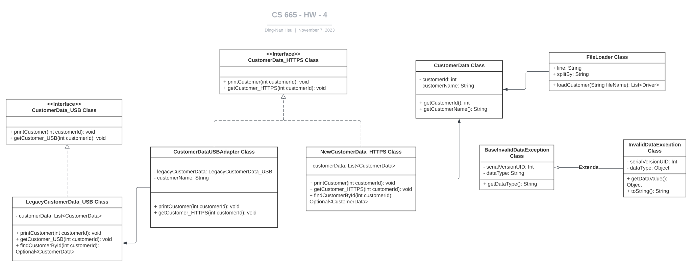

| CS-665       | Software Design & Patterns |
| ------------ | -------------------------- |
| Name         | Dingnan Hsu                |
| Date         | 10/03/2023                 |
| Course       | 2023 Fall                  |
| Assignment # | 2                          |

# Assignment Overview

City retailers have teamed up with local freelance drivers for product deliveries. Develop a system to alert drivers about these requests. When a store gets a delivery order, a notification should be sent to all available drivers.

# GitHub Repository Link:

https://github.com/dddingnan/cs-665-assignment-2

# Implementation Description

For each assignment, please answer the following:

- Explain the level of flexibility in your implementation, including how new object types can
  be easily added or removed in the future.
- Discuss the simplicity and understandability of your implementation, ensuring that it is
  easy for others to read and maintain.
- Describe how you have avoided duplicated code and why it is important.
- If applicable, mention any design patterns you have used and explain why they were
  chosen.

---

### `Answer`

1. `Flexibility`
   - `CSV Data Storage`: Using CSV files for data storage makes it simple to add, modify, or remove drivers without changing the core code. For instance, if we wish to incorporate new types of drivers, such as drone pilots, we simply need to ensure that the new driver class implements the Observer interface by adding into the CSV files.
2. `Simplicity & Understandability`
   - By using the observer pattern, ensuring each class has a single responsibility. This not only makes the code easier to read but also ensures that other developers can maintain and expand upon it without extensive effort.
3. `Avoidance of Duplicated Code`
   - Through `the use of interfaces` and `class inheritance`, duplicated code has been minimized.
4. `Design patterns`
   - `Observer Pattern`: This choice was made to ensure a clear separation between shops (or subjects) and drivers (or observers). When a shop has a new delivery request, it broadcasts this request to all available drivers. [When one object changes state, an open-ended number of dependent objects should be updated automatically.](https://en.wikipedia.org/wiki/Observer_pattern)

## UML Diagram



# Maven Commands

We'll use Apache Maven to compile and run this project. You'll need to install Apache Maven (https://maven.apache.org/) on your system.

Apache Maven is a build automation tool and a project management tool for Java-based projects. Maven provides a standardized way to build, package, and deploy Java applications.

## Compile

Type on the command line:

```bash
mvn clean compile
```

## Run

Type on the command line:

```bash
mvn exec:java
```

## JUnit Tests

JUnit is a popular testing framework for Java. JUnit tests are automated tests that are written to verify that the behavior of a piece of code is as expected.

In JUnit, tests are written as methods within a test class. Each test method tests a specific aspect of the code and is annotated with the @Test annotation. JUnit provides a range of assertions that can be used to verify the behavior of the code being tested.

To run, use the following command:

```bash
mvn clean test
```

## Spotbugs

SpotBugs is a static code analysis tool for Java that detects potential bugs in your code. It is an open-source tool that can be used as a standalone application or integrated into development tools such as Eclipse, IntelliJ, and Gradle.

SpotBugs performs an analysis of the bytecode generated from your Java source code and reports on any potential problems or issues that it finds. This includes things like null pointer exceptions, resource leaks, misused collections, and other common bugs.

Use the following command:

```bash
mvn spotbugs:gui
```

For more info see
https://spotbugs.readthedocs.io/en/latest/maven.html

SpotBugs https://spotbugs.github.io/ is the spiritual successor of FindBugs.

## Checkstyle

Checkstyle is a development tool for checking Java source code against a set of coding standards. It is an open-source tool that can be integrated into various integrated development environments (IDEs), such as Eclipse and IntelliJ, as well as build tools like Maven and Gradle.

Checkstyle performs static code analysis, which means it examines the source code without executing it, and reports on any issues or violations of the coding standards defined in its configuration. This includes issues like code style, code indentation, naming conventions, code structure, and many others.

The following command will generate a report in HTML format that you can open in a web browser.

```bash
mvn checkstyle:checkstyle
```

The HTML page will be found at the following location:
`target/site/checkstyle.html`
